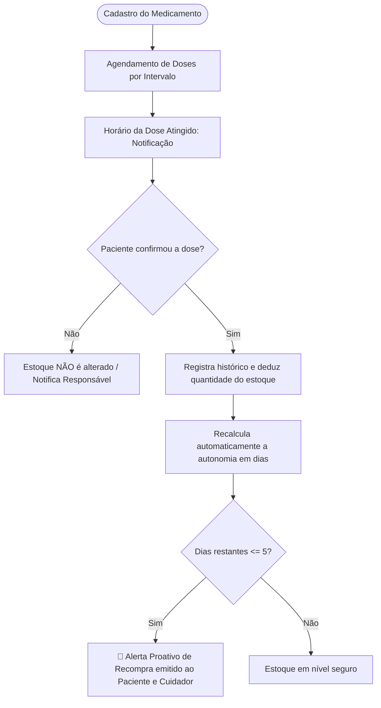
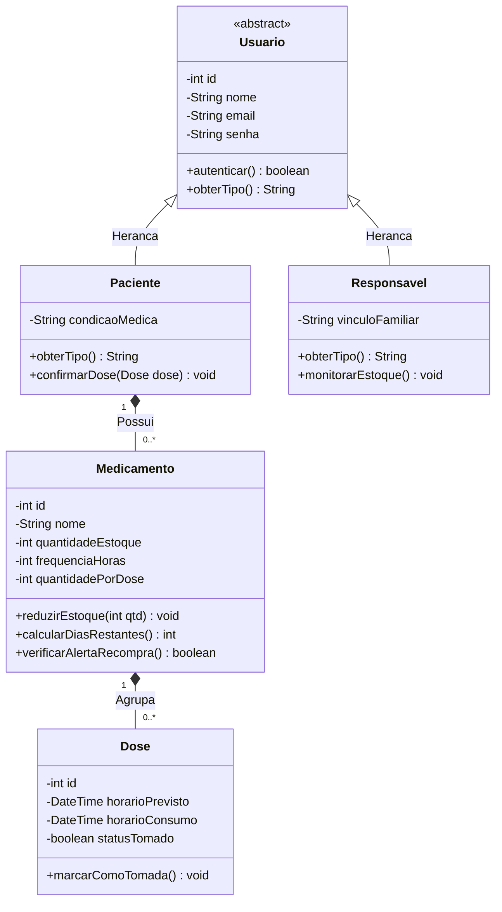
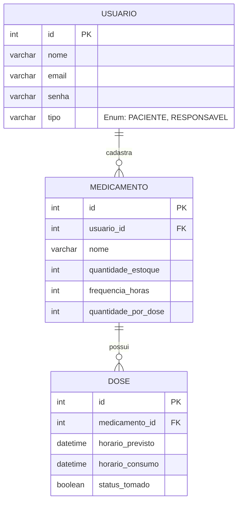

# Gestão de Medicamentos Contínuos e Controle de Estoque Familiar

<p align="center">
  
  
  
  
</p>

---

## 📌 Visão Geral do Projeto

Este projeto é desenvolvido para a **Atividade de Estudo Programada (AEP)** do **4º Semestre**, com foco em engenharia de software, modelagem de sistemas orientados a objetos e persistência relacional.

O objetivo da solução é resolver uma das maiores dores no cuidado à saúde domiciliar: a **baixa adesão a tratamentos contínuos** e o **descontrole de estoque de medicamentos**, fatores que frequentemente levam a omissões de doses, interrupções involuntárias do tratamento e sobrecarga de cuidadores e familiares.

### 🎯 Alinhamento com a ONU: ODS 3 (Saúde e Bem-Estar)
O projeto está alinhado diretamente ao **ODS 3 da ONU (Saúde e Bem-Estar)**, atuando preventivamente na garantia de tratamentos médicos seguros e regulares, diminuindo riscos de internação por descompensação clínica decorrente da falta do medicamento.

---

## ⚙️ Como o Projeto Funciona

O sistema atua em ciclo fechado entre o **horário programado**, a **confirmação do paciente** e a **projeção matemática do estoque**.



### 1. Cadastro e Parametrização
O paciente ou seu responsável cadastra o medicamento informando:
* Nome comercial e dosagem.
* Quantidade inicial em estoque (ex: 60 comprimidos).
* Quantidade consumida por dose (ex: 1 comprimido).
* Frequência em horas entre doses (ex: de 8 em 8 horas).

### 2. Notificação e Confirmação Ativa
* O sistema calcula os horários programados ao longo do dia e notifica o usuário.
* **Regra de Ouro (RN01 e RN06):** O estoque **nunca** é reduzido apenas pela passagem do horário. A dedução exige a **confirmação ativa** do paciente, garantindo que o estoque reflita estritamente o que foi ingerido.

### 3. Cálculo Dinâmico de Autonomia
Após cada baixa de dose, o sistema recalcula a quantidade de dias restantes de tratamento utilizando a relação:

$$\text{Doses Diárias} = \frac{24}{\text{frequencia\_horas}}$$

$$\text{Consumo Diário} = \text{Doses Diárias} \times \text{quantidade\_por\_dose}$$

$$\text{Dias Restantes} = \left\lfloor \frac{\text{quantidade\_estoque}}{\text{Consumo Diário}} \right\rfloor$$

### 4. Alerta Proativo de Recompra (5 Dias)
Se $\text{Dias Restantes} \le 5$, o sistema dispara imediatamente um **alerta proativo de recompra**, oferecendo margem segura para aquisição de novas caixas antes do término do produto.

### 5. Gestão Familiar Compartilhada
Familiares e cuidadores com permissão autorizada podem acompanhar o estoque e o cumprimento das doses em tempo real, auxiliando idosos ou pessoas com mobilidade reduzida.

---

## 📂 Estrutura de Pastas e Diretórios

O repositório foi concebido para manter a rastreabilidade acadêmica e a divisão de responsabilidades de forma limpa:

```text
aep-gestao-medicamentos/
├── Diretrizes Gerais da AEP (4º Semestre de 2026).pdf  # Edital e orientações acadêmicas da instituição
├── README.md                                          # Visão geral, regras de negócio, estrutura e cronograma
│
├── database/                                          # Camada de Persistência e Banco de Dados
│   └── README.md                                      # Diretrizes para scripts SQL, DDL, DML e modelagem
│
├── docs/                                              # Artefatos Formais da 1ª Entrega
│   ├── README.md                                      # Índice descritivo da pasta de documentação
│   └── 1a_entrega.md                                  # Documento completo: Descoberta, ODS, RFs, RNFs, RNs, POO e DER
│
└── src/                                               # Código-Fonte da Aplicação (Java / POO)
    └── README.md                                      # Especificação técnica do código, padrões e convenções
```

### Detalhamento dos Diretórios:
* **`/docs`**: Contém toda a base conceitual da **1ª Entrega**, formalizando levantamento de requisitos, justificativa arquitetural, diagramas Mermaid (Classes e DER) e o alinhamento pedagógico.
* **`/database`**: Abriga as diretrizes e scripts SQL (DDL para criação de tabelas, chaves primárias/estrangeiras e constraints de integridade).
* **`/src`**: Reservado para o código-fonte em Java estruturado segundo o padrão **MVC (Model-View-Controller)** e princípios SOLID/POO.
* **Raiz (`/`)**: Centraliza os arquivos orientativos, edital e o presente README com a síntese de todo o ciclo de vida do projeto.

---

## 🏛️ Arquitetura e Modelagem

### Padrão e Tecnologias
* **Linguagem Java:** Tipagem estática e Orientação a Objetos, assegurando robustez no encapsulamento e reaproveitamento via herança e polimorfismo.
* **Banco de Dados Relacional (SQL):** Integridade referencial (ACID) garantindo que registros de doses pertençam obrigatoriamente a medicamentos e pacientes cadastrados.
* **Arquitetura em Camadas (MVC):** Separação estrita entre Interface (View), Regras de Domínio e Controle (Controller) e Entidades de Dados (Model).

### Diagrama de Classes (POO)



### Diagrama Entidade-Relacionamento (DER)



---

## 📋 Especificação de Requisitos e Regras

### Requisitos Funcionais (RF)
| Identificador | Requisito | Descrição Resumida |
| :--- | :--- | :--- |
| **RF01** | Cadastro de Medicamentos | Nome, estoque inicial, quantidade por dose e horários diários. |
| **RF02** | Sistema de Lembretes | Notificações nos horários configurados para cada remédio. |
| **RF03** | Confirmação de Dose | Registro formal de ingestão da dose pelo usuário. |
| **RF04** | Controle Automático de Estoque | Dedução imediata da quantidade e cálculo dos dias restantes. |
| **RF05** | Alerta de Recompra | Notificação antecipada quando a autonomia for $\le 5$ dias. |
| **RF06** | Gestão Familiar | Acesso supervisionado a familiares com autorização prévia. |
| **RF07** | Ajuste Manual de Estoque | Atualização do estoque em novas compras ou conferência física. |

### Regras de Negócio Chave (RN)
* **RN01 & RN06 (Consumo e Confirmação):** O estoque apenas é baixado mediante confirmação explícita.
* **RN03 (Gatilho de 5 Dias):** O alerta de reposição é disparado automaticamente se `diasRestantes <= 5`.
* **RN04 (Não-Negatividade):** O estoque nunca pode assumir valores inferiores a zero.
* **RN08 (Privacidade):** Acompanhamento por terceiros restringe-se a autorização explícita do paciente.

---

## 📅 Cronograma de Execução da AEP

| Data | Atividade | Responsável | Status |
| :---: | :--- | :---: | :---: |
| 01/09/2026 | Levantamento de Requisitos e Definição de Escopo | Equipe | Concluído |
| 05/09/2026 | Elaboração da Documentação da 1ª Entrega | Equipe | Concluído |
| 06/09/2026 | Modelagem de Dados (Diagrama de Classes e DER) | Equipe | Concluído |
| 08/09/2026 | Criação e Estruturação do Repositório GitHub | Equipe | Concluído |
| **09/09/2026** | **Envio da 1ª Entrega (Concepção e Planejamento)** | **Equipe** | **Entregue** |
| 15/09/2026 | Configuração do Ambiente e Banco de Dados | Equipe | A Iniciar |
| 20/09/2026 | Desenvolvimento do Back-end (CRUD e Regras de Negócio) | Equipe | Planejado |
| 15/10/2026 | Integração com Banco de Dados | Equipe | Planejado |
| 20/10/2026 | Testes, Validação e Ajustes Finais | Equipe | Planejado |
| **20/11/2026** | **Envio da 2ª Entrega (Software Funcional Integrado)** | **Equipe** | **Planejado** |

---

## 🚀 Roadmap e Visão de Futuro (Pós-MVP)

Para além dos entregáveis acadêmicos, a arquitetura do projeto foi desenhada visando evolução contínua:
* 📦 **Integração com API da ANVISA:** Leitura de código de barras para autopreenchimento de posologia e lote.
* 📲 **Disparo Externo (WhatsApp/SMS):** Integração com APIs como Twilio para alertar cuidadores se doses forem esquecidas.
* 📍 **Geolocalização de Farmácias:** Sugestão de farmácias parceiras com delivery quando o estoque atingir o alerta de 5 dias.
* 🏆 **Gamificação de Adesão:** Sistema de pontuação e sequência diária (*streaks*) para estimular idosos no cumprimento do horário.
* 📄 **Relatórios Médicos em PDF:** Exportação de histórico de adesão para acompanhamento em consultas clínicas.
