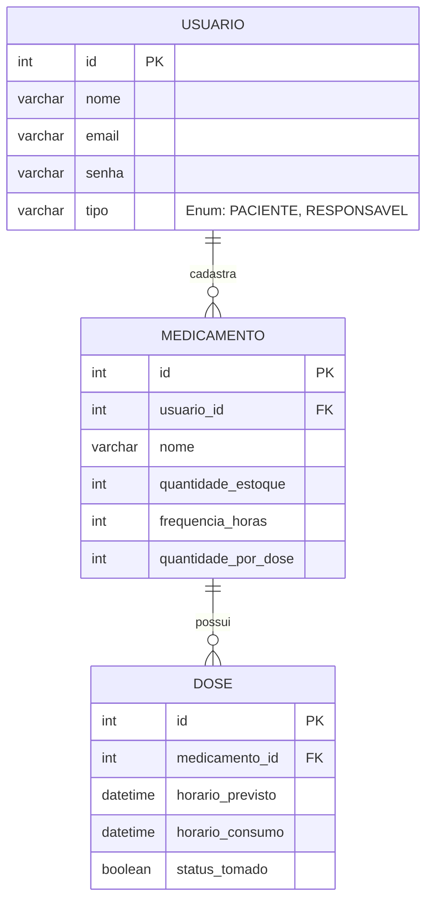

# 1ª Entrega - Gestão de Medicamentos Contínuos e Controle de Estoque Familiar

## 1. Descoberta
O projeto de **Gestão de Medicamentos Contínuos e Controle de Estoque Familiar** surgiu da identificação de um problema comum: a dificuldade de manter uma rotina organizada de medicamentos. Atualmente, o processo de gestão é baseado em memória ou anotações manuais, o que gera esquecimentos, erros de administração, e percepção tardia da falta do remédio.

**Principais Dores Identificadas:**
*   Esquecimento dos horários das doses, especialmente para pacientes com múltiplos medicamentos.
*   Falta de controle preciso do estoque, dificultando o planejamento da recompra.
*   Percepção tardia do fim do medicamento, gerando risco de interrupção do tratamento.
*   Dificuldade de familiares/cuidadores acompanharem o tratamento de forma centralizada e remota.
*   A complexidade de gerenciar e conciliar horários e quantidades diferentes para vários medicamentos simultâneos.

**Origem:** A ausência de um sistema integrado e a dependência do cálculo manual para estimar a duração de uma caixa.

**Entrega de Valor e Regras de Negócios Principais:** 
O sistema focará em fornecer previsibilidade. Ao conectar as doses diárias (consumo) ao estoque total, o sistema reduzirá automaticamente o estoque apenas com a confirmação explícita do usuário de que tomou a medicação. Gerando assim, de forma proativa, alertas quando o estoque for suficiente para apenas 5 dias, permitindo a reposição com calma e segurança.

## 2. Concepção e Alinhamento com a ONU (ODS)
Este projeto soluciona problemas diretamente ligados ao **ODS 3 (Saúde e Bem-Estar)** da ONU. Ao ajudar pacientes a manter a adesão correta aos tratamentos médicos contínuos, evita complicações de saúde e promove uma melhor qualidade de vida. O sistema atua de forma preventiva, assegurando que o tratamento não seja interrompido por falta de medicamento, o que é fundamental para a manutenção da saúde.

## 3. Justificativa Técnica e Arquitetural
*   **Linguagem (Java / C#):** A linguagem (a ser definida pela equipe) será fortemente tipada e Orientada a Objetos, garantindo a criação de entidades claras (Medicamento, Dose, Usuário) e a correta aplicação dos pilares de POO (Polimorfismo, Herança e Encapsulamento) essenciais para a manutenibilidade do software.
*   **Banco de Dados (SQL Relacional):** Um banco de dados relacional (ex: PostgreSQL ou MySQL) será utilizado para garantir a integridade dos dados (ACID) e permitir o cruzamento correto entre o Usuário, o Medicamento e o Estoque, essencial para os requisitos e para o envio de alertas.
*   **Padrão Arquitetural (MVC / MVC-Like):** A separação entre Interface/Apresentação (View), Regras de Negócio (Controller) e Acesso a Dados (Model/Repository) facilitará o desenvolvimento das operações de CRUD isolando as responsabilidades.

## 4. Ambiente de Controle de Versão
O projeto está sendo versionado utilizando a plataforma GitHub.
**Link do Repositório:** `[INSERIR O LINK PÚBLICO DO GITHUB AQUI]`

## 5. Estrutura do Repositório
O repositório foi organizado da seguinte forma para manter a lógica e a clareza das entregas:
*   `/src`: Código-fonte da aplicação (classes, interfaces, controllers).
*   `/docs`: Artefatos de documentação, incluindo este documento e modelos de diagramas.
*   `/database`: Scripts SQL necessários para criar e popular as tabelas do banco de dados.

## 6. Diagrama de Classe

```mermaid
classDiagram
    class Usuario {
        <<abstract>>
        -int id
        -String nome
        -String email
        -String senha
        +autenticar() boolean
        +obterTipo() String*
    }

    class Paciente {
        -String condicaoMedica
        +obterTipo() String
        +confirmarDose(Dose dose) void
    }

    class Responsavel {
        -String vinculoFamiliar
        +obterTipo() String
        +monitorarEstoque() void
    }

    class Medicamento {
        -int id
        -String nome
        -int quantidadeEstoque
        -int frequenciaHoras
        -int quantidadePorDose
        +reduzirEstoque(int qtd) void
        +calcularDiasRestantes() int
        +verificarAlertaRecompra() boolean
    }

    class Dose {
        -int id
        -DateTime horarioPrevisto
        -DateTime horarioConsumo
        -boolean statusTomado
        +marcarComoTomada() void
    }

    Usuario <|-- Paciente : Herança
    Usuario <|-- Responsavel : Herança
    Paciente "1" *-- "0..*" Medicamento : Composição (1:N)
    Medicamento "1" *-- "0..*" Dose : Composição (1:N)
```

## 7. Diagrama do Banco


