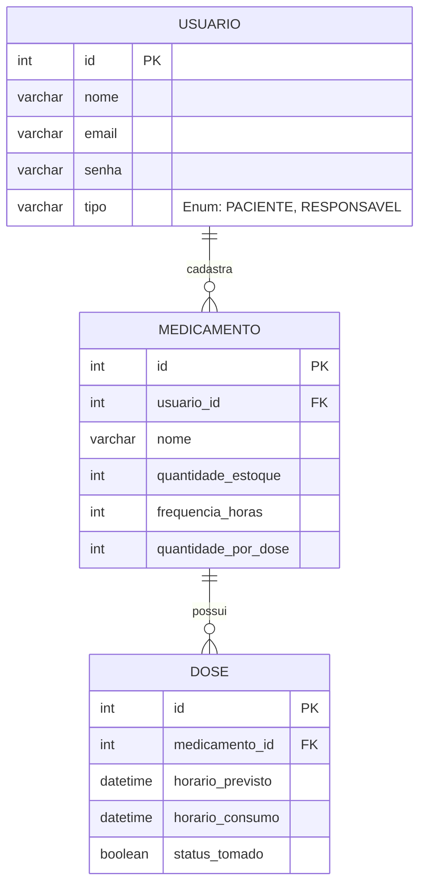

# 1ª Entrega - Gestão de Medicamentos Contínuos e Controle de Estoque Familiar

---

## 1. Descoberta
O projeto de **Gestão de Medicamentos Contínuos e Controle de Estoque Familiar** surgiu da identificação de um problema comum: a dificuldade de manter uma rotina organizada de medicamentos. Atualmente, o processo de gestão é baseado em memória ou anotações manuais, o que gera esquecimentos, erros de administração, e percepção tardia da falta do remédio.

**Principais Dores Identificadas:**
*   Esquecimento dos horários das doses, especialmente para pacientes com múltiplos medicamentos.
*   Falta de controle preciso do estoque, dificultando o planejamento da recompra.
*   Percepção tardia do fim do medicamento, gerando risco de interrupção do tratamento.
*   Dificuldade de familiares/cuidadores acompanharem o tratamento de forma centralizada e remota.
*   A complexidade de gerenciar e conciliar horários e quantidades diferentes para vários medicamentos simultâneos.

**Origem:** A ausência de um sistema integrado e a dependência do cálculo manual para estimar a duração de uma caixa.

**Entrega de Valor:** 
O sistema focará em fornecer previsibilidade. Ao conectar as doses diárias (consumo) ao estoque total, o sistema reduzirá automaticamente o estoque apenas com a confirmação explícita do usuário de que tomou a medicação. Gerando assim, de forma proativa, alertas quando o estoque for suficiente para apenas 5 dias, permitindo a reposição com calma e segurança.

---

## 2. Concepção e Alinhamento com a ONU (ODS)
Este projeto soluciona problemas diretamente ligados ao **ODS 3 (Saúde e Bem-Estar)** da ONU. Ao ajudar pacientes a manter a adesão correta aos tratamentos médicos contínuos, evita complicações de saúde e promove uma melhor qualidade de vida. O sistema atua de forma preventiva, assegurando que o tratamento não seja interrompido por falta de medicamento, o que é fundamental para a manutenção da saúde e promoção do bem-estar.

---

## 3. Escopo: Requisitos Funcionais, Não Funcionais e Regras de Negócio

### 3.1. Requisitos Funcionais (RF)
*   **RF01 - Cadastro de Medicamentos:** O sistema deve permitir o cadastro de medicamentos, com nome, quantidade inicial de comprimidos disponíveis, quantidade utilizada em cada dose e os horários das doses diárias.
*   **RF02 - Sistema de Lembretes:** O sistema deve gerar lembretes e notificações nos horários configurados para a administração de cada medicamento.
*   **RF03 - Confirmação de Dose:** O sistema deve permitir que o usuário confirme que tomou o medicamento em uma determinada dose, efetuando a baixa no sistema.
*   **RF04 - Controle Automático de Estoque:** O sistema deve reduzir automaticamente o estoque do medicamento correspondente e calcular quantos dias de tratamento ainda restam logo após a confirmação da dose.
*   **RF05 - Alerta de Recompra:** O sistema deve alertar o usuário proativamente quando a quantidade disponível em estoque representar 5 dias ou menos de tratamento.
*   **RF06 - Gestão Familiar:** O sistema deve permitir que familiares ou responsáveis acompanhem as informações de estoque e rotina de doses, desde que possuam autorização prévia do usuário.
*   **RF07 - Ajuste Manual de Estoque:** O sistema deve permitir que o usuário ajuste manualmente o estoque de um medicamento em caso de nova compra ou correção.

### 3.2. Requisitos Não Funcionais (RNF)
*   **RNF01 - Usabilidade:** O sistema deve possuir uma interface clara e de fácil utilização, considerando que parte do público-alvo pode ser composta por idosos.
*   **RNF02 - Desempenho e Disponibilidade:** O cálculo de dias restantes e o disparo de alertas devem ocorrer de forma imediata (tempo de resposta inferior a 2 segundos) após a confirmação de uma dose.
*   **RNF03 - Segurança e Privacidade:** Os dados médicos e as rotinas dos pacientes devem estar protegidos e o acesso de responsáveis só pode ocorrer mediante autorização explícita (Controle de Acesso).

### 3.3. Regras de Negócio (RN)
*   **RN01 - Controle de estoque:** O estoque somente deverá ser reduzido quando uma dose for registrada como tomada.
*   **RN02 - Quantidade descontada:** A quantidade retirada do estoque deverá corresponder à quantidade de comprimidos definida para aquela dose.
*   **RN03 - Alerta de recompra:** O sistema deverá gerar um alerta quando a quantidade disponível representar 5 dias ou menos de tratamento, considerando o consumo diário cadastrado.
*   **RN04 - Estoque insuficiente:** O estoque de um medicamento nunca poderá assumir valores negativos.
*   **RN05 - Cálculo dos dias restantes:** A quantidade de dias restantes deverá ser recalculada sempre que houver alteração no estoque, na quantidade utilizada por dose ou na frequência de utilização.
*   **RN06 - Confirmação da dose:** Um medicamento não deverá ser considerado consumido apenas porque o horário da dose passou. O usuário deverá confirmar explicitamente que realizou o consumo.
*   **RN07 - Alteração do estoque:** O usuário poderá ajustar manualmente o estoque quando realizar uma nova compra ou quando houver necessidade de correção de contagem.
*   **RN08 - Acompanhamento familiar:** Familiares ou responsáveis somente poderão visualizar as informações de medicamentos quando tiverem autorização do usuário responsável (Paciente).

---

## 4. Justificativa Técnica e Arquitetural
*   **Linguagem (Java):** A linguagem será fortemente tipada e Orientada a Objetos, garantindo a criação de entidades claras (Medicamento, Dose, Usuário) e a correta aplicação dos pilares de POO (Polimorfismo, Herança e Encapsulamento) essenciais para a manutenibilidade e escalabilidade do software.
*   **Banco de Dados (SQL Relacional):** Um banco de dados relacional (ex: PostgreSQL/MySQL) será utilizado para garantir a integridade dos dados (ACID) e permitir o cruzamento correto entre o Usuário, o Medicamento e o Histórico de Doses (Dose).
*   **Padrão Arquitetural (MVC):** A separação entre Interface/Apresentação (View), Regras de Negócio (Controller) e Acesso a Dados (Model) facilitará o desenvolvimento das operações de CRUD, isolando responsabilidades.

---

## 5. Ambiente de Controle de Versão e Estrutura
O projeto está sendo versionado utilizando a plataforma GitHub.
*   **Link Público do Repositório:** https://github.com/Fximis/aep-gestao-medicamentos

**Estrutura de Diretórios:**
*   `/src`: Código-fonte da aplicação (classes, interfaces, pacote `models`).
*   `/docs`: Artefatos de documentação, arquivos de planejamento e este documento.
*   `/database`: Scripts SQL contendo as queries (DDL) necessárias para criar e estruturar o banco de dados.

---

## 6. Diagrama de Classe (POO)

```mermaid
classDiagram
    class Usuario {
        <<abstract>>
        -int id
        -String nome
        -String email
        -String senha
        +autenticar() boolean
        +obterTipo() String*
    }

    class Paciente {
        -String condicaoMedica
        +obterTipo() String
        +confirmarDose(Dose dose) void
    }

    class Responsavel {
        -String vinculoFamiliar
        +obterTipo() String
        +monitorarEstoque() void
    }

    class Medicamento {
        -int id
        -String nome
        -int quantidadeEstoque
        -int frequenciaHoras
        -int quantidadePorDose
        +reduzirEstoque(int qtd) void
        +calcularDiasRestantes() int
        +verificarAlertaRecompra() boolean
    }

    class Dose {
        -int id
        -DateTime horarioPrevisto
        -DateTime horarioConsumo
        -boolean statusTomado
        +marcarComoTomada() void
    }

    Usuario <|-- Paciente : Herança
    Usuario <|-- Responsavel : Herança
    Paciente "1" *-- "0..*" Medicamento : Composição (1:N)
    Medicamento "1" *-- "0..*" Dose : Composição (1:N)
```

---

## 7. Diagrama do Banco (DER)



---

## 8. Cronograma de Execução

| Data | Atividade | Responsável |
| :--- | :--- | :--- |
| 15/09/2026 | Levantamento de Requisitos e Definição de Escopo | Equipe |
| 22/09/2026 | Elaboração da Documentação (PDF) da 1ª Entrega | Equipe |
| 25/09/2026 | Modelagem de Dados (Diagrama de Classes e DER) | Equipe |
| 28/09/2026 | Criação e Estruturação do Repositório GitHub | Equipe |
| **30/09/2026** | **Envio da 1ª Entrega (Concepção e Planejamento)** | **Equipe** |
| 10/10/2026 | Configuração do Ambiente e Banco de Dados | Equipe |
| 20/10/2026 | Desenvolvimento do Back-end (CRUD e Regras de Negócio) | Equipe |
| 05/11/2026 | Integração com Banco de Dados | Equipe |
| 15/11/2026 | Testes, Validação e Ajustes Finais | Equipe |
| **25/11/2026** | **Envio da 2ª Entrega (Software Funcional Integrado)** | **Equipe** |

---

## 9. Visão de Futuro e Evolução (Roadmap)
Para garantir que o software seja escalável e atenda a necessidades reais de mercado além do escopo inicial (MVP), projetamos as seguintes funcionalidades para iterações futuras:
*   **Integração com API da ANVISA:** Cadastro ágil e automatizado dos medicamentos via leitura do código de barras.
*   **Notificações Externas de Alerta:** Integração com APIs de mensageria (como Twilio) para enviar SMS/WhatsApp ao paciente nos horários das doses, e alertas aos familiares em caso de omissão recorrente.
*   **Inteligência de Geolocalização:** Sugestão de farmácias próximas baseadas na localização do GPS do usuário para facilitar a recompra via delivery.
*   **Gamificação da Saúde (Adesão):** Criação de um sistema de recompensas e *streaks* (dias consecutivos sem errar a dose).
*   **Geração de Relatórios Clínicos:** Exportação do histórico de uso em formato PDF para que o paciente possa compartilhar com seu médico.
